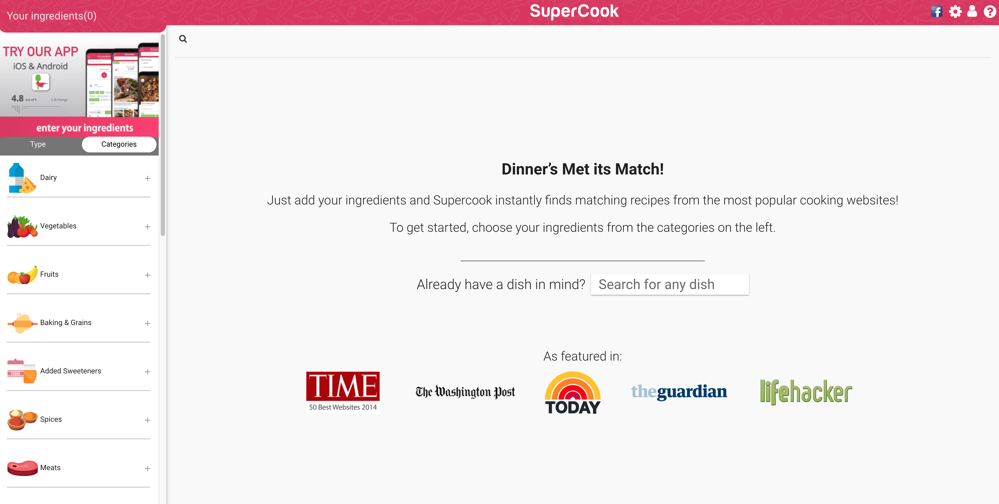
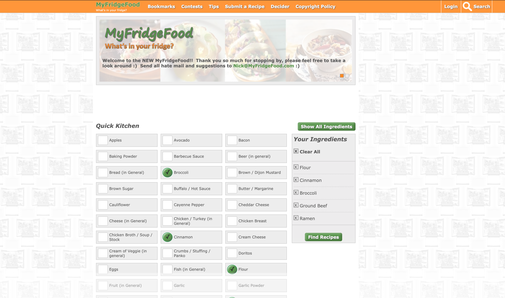

# Website for recipes using already bought groceries
### Stephanie Chang - DH150 Advanced Topics in Digital Humanities: User Experience Design
*I want to create a website that increases convenience for middle-aged women, where they can select ingredients they already have and find recipes.*  

## **Supercook**

https://www.supercook.com/#/recipes

The website's purpose can be easily understood. It allows for its users to search up recipes using what they already have and shows many recipe options. However, the list to choose food items can be super long, making it hard to find ingredients one already has. 

### **Heuristics**
**1 Visibility of system status**

*Rating: 1*
- Once the user selects the ingredient, a green checkmark appears, showing that the ingredient is selected. This allows the user to know that they already selected to ingredient.
- When the ingredient category is expanded, the + that was originally there becomes a - . This makes it clear whether or not the category is expanded or not.
- After clicking the ingredients, there isn't anything that indicates a loading screen. This may cause confusion to users, as they don't know if the website is searching for recipes yet.
- After clicking to add an ingredient where the site asks "Do you have?", it doesn't clearly show that the ingredient is being added or tell you whether or not the ingredient was added. Thus, one could be unclear if the ingredient was added if they don't check the Type tab.

**2 Match between system and the real world**

*Rating: 0*
- The language is easy to understand. 
- Information is presented in a natural and logical way, with the website saying to choose ingredients first.

**3 User control and freedom**

*Rating: 2*
- The clear all button for ingredients isn't visible. If one wants to delete all ingredients, they have to press the settings button and then "Delete all my ingredients." This button is pretty hidden and many users may not be able to find it.
- There isn't a straightforward way to remove certain ingredients. In order to remove an ingredient, one has to uncheck the ingredient we already selected or go to the type tab and press the trashcan button. However, it is difficult to find a ingredient that one has already checked if they marked many ingredients, and it isn't clear what the type tab is for.

**4 Consistency and standards**

*Rating: 3*
- There is no internal consistency for adding ingredients. Under the Categories tab, adding an ingredient is a checkmark. However, once ingredients show up and the site asks "Do you have?" and lists more ingredients you could add, it is a plus sign.
- There is no internal consistency for removing ingredients. Under the Categories and Type tab, you can remove ingredients you selected. However, the Categories tab removes ingredients by clicking the already checked box, while the Type tab removes ingredients through a trash can. 
- There isn't a consistent color that shows what is an actionable button, as the checkmark is green once you select a ingredient, but the text for how many ingredients selected and whether you have all the ingredients is also green.

**5 Error prevention**

*Rating: 1*
- When you spell a word wrong in the search bar, it does not allow you to add it and does not give you a suggestion once you start spelling the word wrong. This may be confusing for users as nothing prevented the user from spelling the ingredient wrong and no suggestions are given.

**6 Recognition rather than recall**

*Rating: 0*
- The website allows for users to create an account and favorite recipes. This allows easy access to recipes that one plans to make or is a fan of.
- The website keeps ingredients selected from the last time when opening up the site again. 

**7 Flexibility and efficiency of use**

*Rating:1*
- The "Delete all my ingredients" button exists, which makes it faster for users to remove all their ingredients using that button instead of going through the list and removing each ingredient one by one. However, this button is hard to find. 
- If users want to check what ingredients they already selected, they can press the type tab to see what they selected. However, the website does not make it clear what the type tab is until you press into, and some may not notice that there is the tab.

**8 Aesthetic and minimalist design**

*Rating: 2*
- The website is not completely focused on the essentials, showing some irrelevant information, such as the logo on each recipe card and website the recipe is on. Because there is so much going on, it may be hard to pinpoint what is important and what is not.
- The photos on the website are sometimes too blurry to get the message of what the recipe will make across, making it difficult for users to navigate the site.

**9 Help users recognize, diagnose, and recover from errors**

*Rating: 1*
- The website tells you when there are "No matches found for that combination," which allows you to know that there are no recipes for what you selected. However, it doesn't offer any suggestions on what you should do. 

**10 Help and documentation**

*Rating: 0*
- The front page provides help on what your first steps are to start your search for recipes, telling you to "choose your ingredients from the categories on the left."
- The front page also has a search bar that states "Search for any dish," allowing you to know what to do with that search bar. 
- The search bar used to add ingredients states "Add an ingredient," which provides help on what you should do with that search bar.

## **MyFridgeFood**

https://myfridgefood.com/
The website can be used easily, with users being able to add ingredients. However, it is a little messy, making it hard to look for the recipes.

### **Heuristics**
**1 Visibility of system status**

*Rating: 0*
- When hovering over the ingredients, the website enlarges the box, indicating which one you are about to select.
- Once the ingredient is selected, a green checkmark appears to indicate the ingredient has already been selected.
- The site clearly shows the ingredients chosen by the right side. 

**2 Match between system and the real world**

*Rating: 0*
- When clicking into the recipe, the page is similar to that of a recipe book. Because it is familiar, the experience on the site is more enjoyable. 
- The ingredients list on the right has a X over it, which is similar to other signals of delete in real life. Because there is a match between the system and the real world, one knows that clicking on the text means teh text will remove the ingredient fromt he list.
- The language is easy to understand.

**3 User control and freedom**

*Rating: 1*
- On the ingredients list on the right side, when one hovers over the ingredients, the text becomes red, signifying that pressing the text will remove the ingredient from the list.
- After selecting ingredients and pressing "Find Recipes," there isn't a clear way on how to go back to select or remove ingredients.

**4 Consistency and standards**

*Rating: 0*
- There is internal consistency, as the call to action buttons are green. This allows the user to clearly know which buttons can be clicked to perform an action.

**5 Error prevention**

*Rating: 1*
- The ingredients list on the right tell you when there are no ingredients checked. Thus, the user won't go into the recipe list thinking they chose ingredients and not find any recipes, preventing this error.

**6 Recognition rather than recall**

*Rating: 0*
- The user can create an account and log in to bookmark the recipe.

**7 Flexibility and efficiency of use**

*Rating: 3*
- There is a clear all button by the side, which makes it faster to remove all the ingredients instead of removing all the ingredients one by one. 
- When one wants to add more or remove ingredients, there is no way to do so once already searching for recipes.

**8 Aesthetic and minimalist design**

*Rating: 3*
- When there is no photo available, an image telling people to enter a contest is used instead. This shows some irrelevant information that users may not be looking for. 
- On the front page, the top banner alternates between the homepage banner and a banner about entering a contest. This crowds up the website with irrelevant information.
- The recipe cards go into very detailed nutritional facts, which may be irrelevant to some users. Thus, the amount of text makes it hard for users to find information.
- The description is not very helpful when choosing what recipe one wants to make. 

**9 Help users recognize, diagnose, and recover from errors**

*Rating: 1*
- When there are no results, the website says "No results found." However, it does not offer suggestions as to what one should do. 

**10 Help and documentation**

*Rating: 0*
- The buttons state what the action is leading to, providing help to the user of the website.
- A related tips button exists on certain recipe pages, which allows users to get help when making a recipe.

